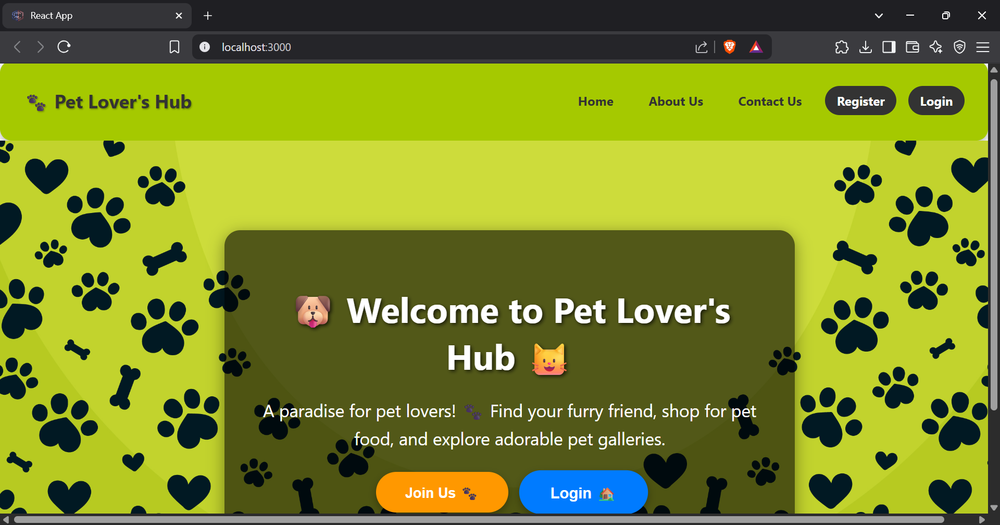
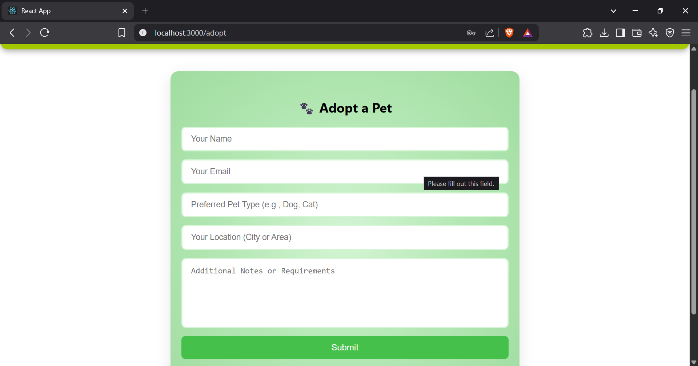
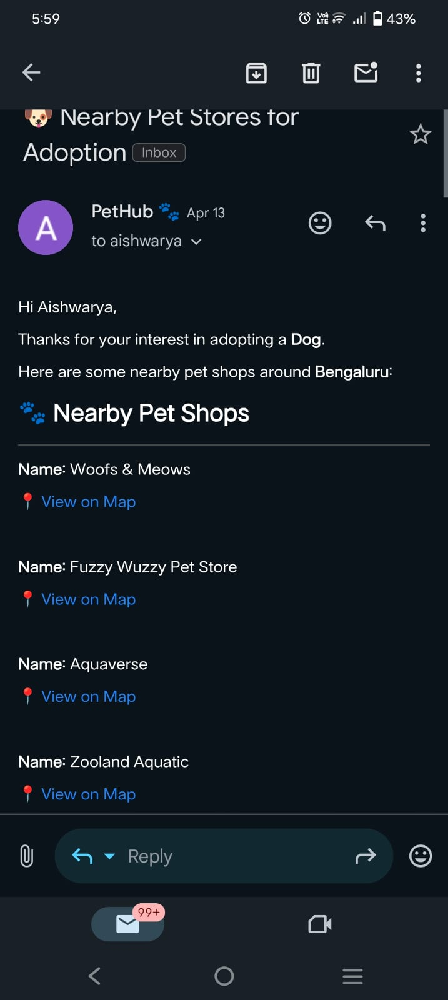
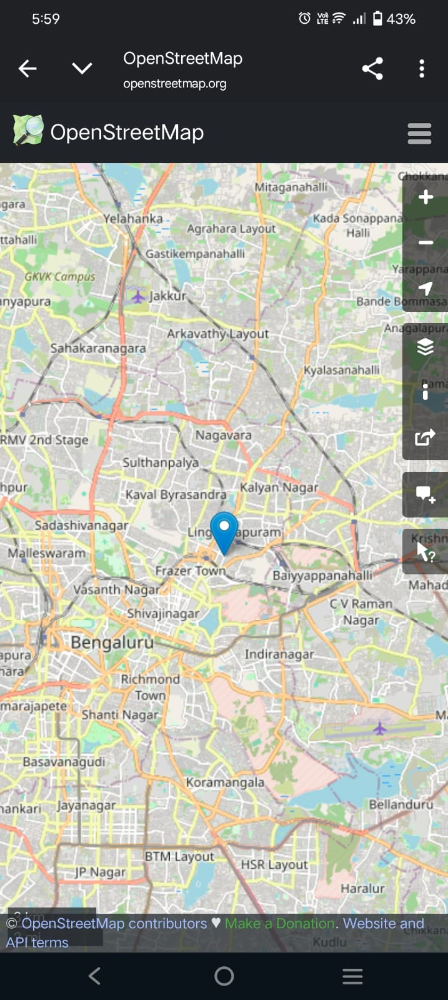
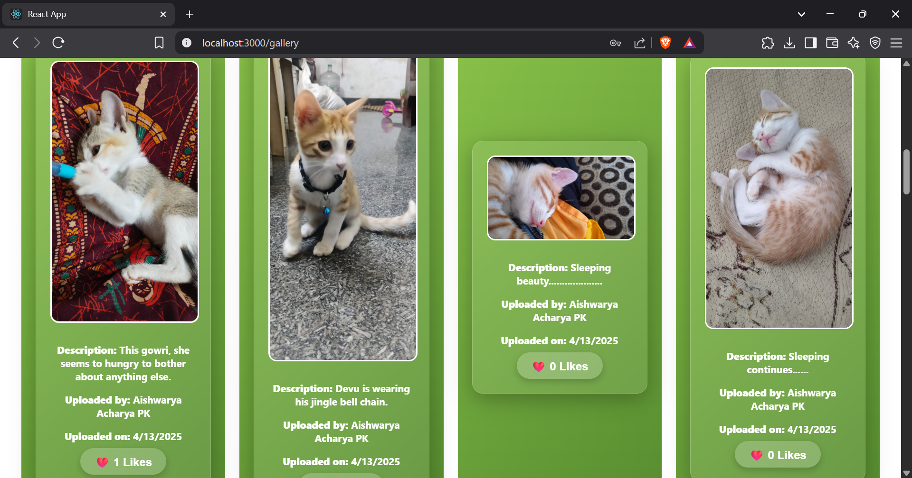
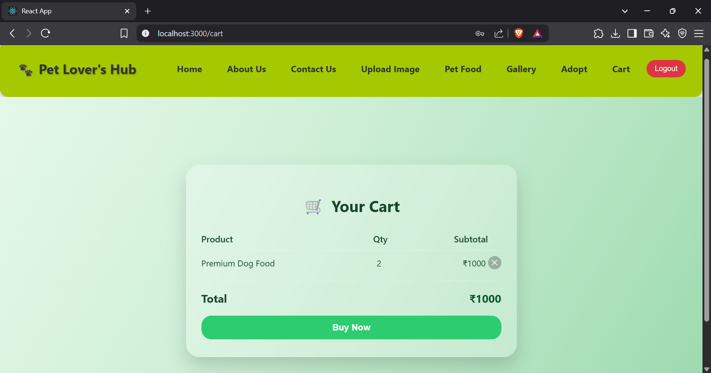
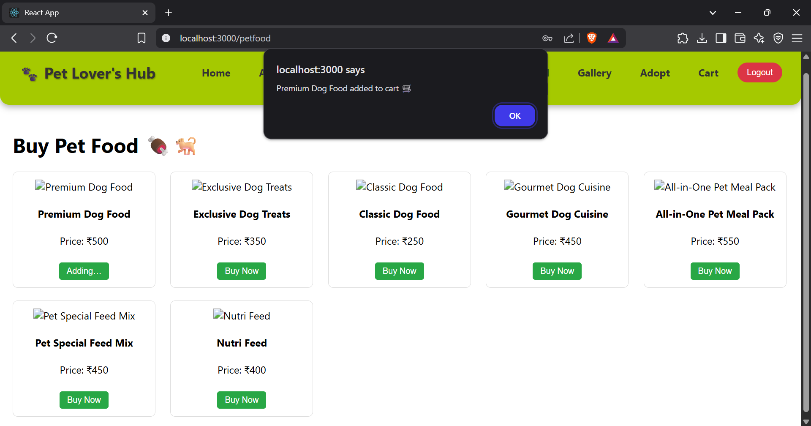

Happy Habitat Hub 🐾 is a green‑tech platform that connects pets with loving owners through an interactive, easy‑to‑use ecosystem—making every step from search to snuggle beautifully seamless.

How we simplify adoption

1.🌍 Discover nearby stores & shelters
• Geo‑smart map pinpoints reputable pet stores and adoption centers within your chosen radius.

2.🐶 Filter by pet type & location
• Need a playful pup or a chill cat? Set species, size and distance once—see only perfect matches.

3.📧 Real‑time email alerts
• The moment a pet fitting your criteria appears, you receive an email with store details, photos and one‑tap directions.

4.📸 Upload & Like gallery
• Share pictures of your own pets, browse community uploads and tap ❤️if u like the image.

5.🛒 Eco‑friendly food & gear cart
• Add vet‑approved food and toys in one click; adjust quantities or remove items with a ✕ before checkout.

6.✅ Soft‑glass Cart & Buy Now
• A sleek, glassmorphic cart totals everything, and a single “Buy Now” button completes the purchase—confetti included!

7.🤝 Community, not just commerce
• Track your likes, adoptions and purchases in My Habitat Timeline and connect with fellow pet lovers in a safe, supportive space.
